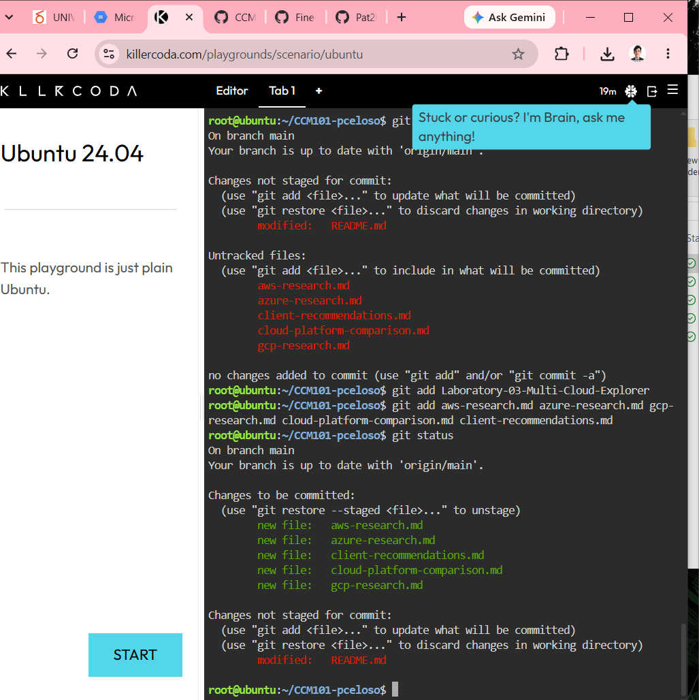

# Laboratory 03 – Multi-Cloud Explorer

## Mission Overview

This laboratory activity explores AWS, Microsoft Azure, and Google Cloud Platform. The activity compares their services and evaluates which cloud provider is appropriate for different business scenarios.

## Linux Environment Investigation

### Operating System

The KillerCoda Linux environment is running:

**Ubuntu 24.04.4 LTS (Noble Numbat)**

The operating system was identified using the `cat /etc/os-release` command. The system uses the Ubuntu 24.04 LTS release with the **x86_64** architecture.

### CPU Information

The CPU information observed using `lscpu` was:

- **CPU(s):** 1
- **Architecture:** x86_64
- **CPU Model:** Intel Xeon E312xx (Sandy Bridge, IBRS update)
- **CPU Family:** 6
- **Cores per Socket:** 1
- **Threads per Core:** 1
- **Socket(s):** 1
- **Hypervisor Vendor:** KVM
- **Virtualization Type:** Full

The KillerCoda environment provides one virtual CPU. The CPU is presented as an Intel Xeon processor and runs inside a KVM virtualized environment.

### Memory

The memory information observed using `free -h` was:

- **Total Memory:** 1.9 GiB
- **Used Memory:** 419 MiB
- **Free Memory:** 835 MiB
- **Shared Memory:** 1.1 MiB
- **Buff/Cache:** 816 MiB
- **Available Memory:** 1.4 GiB
- **Total Swap:** 1.0 GiB
- **Used Swap:** 0 B
- **Free Swap:** 1.0 GiB

The Linux environment has approximately 1.9 GiB of RAM available. At the time of observation, 419 MiB was being used, while 1.4 GiB was still available.

### Disk Space

The disk information observed using `df -h` was:

| Filesystem | Size | Used | Available | Use% | Mounted on |
|---|---:|---:|---:|---:|---|
| tmpfs | 191M | 1000K | 190M | 1% | /run |
| /dev/vda1 | 19G | 5.4G | 13G | 30% | / |
| tmpfs | 952M | 84K | 952M | 1% | /dev/shm |
| tmpfs | 5.0M | 0 | 5.0M | 0% | /run/lock |
| /dev/vda16 | 881M | 117M | 703M | 15% | /boot |
| /dev/vda15 | 105M | 6.2M | 99M | 6% | /boot/efi |

The main filesystem, `/dev/vda1`, has a total size of 19 GB. Approximately 5.4 GB is currently used, leaving around 13 GB available. The main filesystem is currently using 30% of its available storage.

## Cloud Hosting Equivalents

If this Linux server were migrated to a cloud environment, equivalent virtual machine services could be used.

### AWS

A suitable AWS service would be **Amazon EC2** because it provides virtual computing instances where Linux operating systems can run. The Linux server could be deployed as an EC2 instance with CPU, memory, storage, and networking resources selected according to the application's requirements.

### Microsoft Azure

A suitable Azure service would be **Azure Virtual Machines** because it provides virtual machines that can run Linux operating systems. The virtual machine can be configured with appropriate computing, memory, storage, and networking resources.

### Google Cloud Platform

A suitable GCP service would be **Compute Engine** because it provides configurable virtual machines for running Linux workloads. The server could be migrated to a Compute Engine virtual machine with resources appropriate for the workload.

## Screenshot Evidence

The screenshot shows the KillerCoda Linux terminal and the commands used to investigate the operating system, CPU, memory, and disk resources of the Linux environment.
