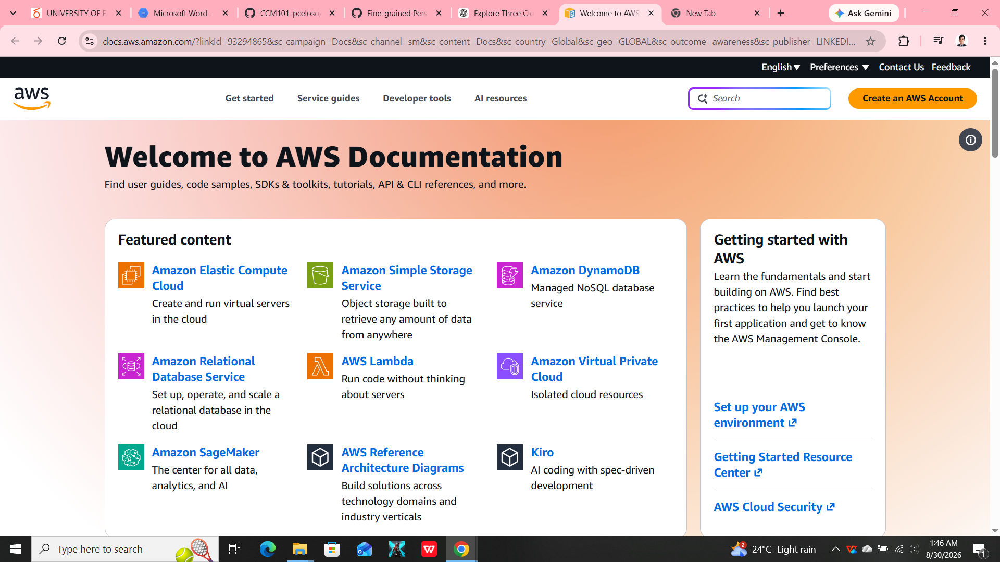

 # AWS Research

## Brief Overview

Amazon Web Services (AWS) is a cloud computing platform that provides a wide range of cloud services for individuals, businesses, organizations, and governments. It provides computing, storage, networking, database, security, and other cloud capabilities through an on-demand model.

## Global Infrastructure

AWS operates a global infrastructure made up of Regions and Availability Zones. Regions are separate geographic areas, while Availability Zones are isolated locations within a Region. This infrastructure helps organizations deploy applications closer to their users and improve availability.

## Cloud Management Console

The AWS Management Console is a web-based interface used to access and manage AWS services. Users can use the console to create resources, monitor services, configure settings, and manage their cloud environment.

## Four Core Services

### 1. Amazon EC2

Amazon Elastic Compute Cloud (EC2) provides virtual servers that can be used to run applications and workloads.

### 2. Amazon S3

Amazon Simple Storage Service (S3) provides object storage for files, backups, media, and other data.

### 3. Amazon VPC

Amazon Virtual Private Cloud (VPC) allows users to create and manage isolated virtual networks in AWS.

### 4. AWS IAM

AWS Identity and Access Management (IAM) controls access to AWS resources and services.

## Three Advantages

1. AWS provides a large selection of cloud services.
2. AWS can scale resources according to workload requirements.
3. AWS has a global infrastructure that supports applications in different geographic locations.

## Typical Enterprise Use Cases

AWS can be used by enterprises for web applications, data storage, backup and disaster recovery, databases, analytics, application hosting, and scalable business systems.

## Screenshot Evidence

AWS official homepage or management console screenshot:

