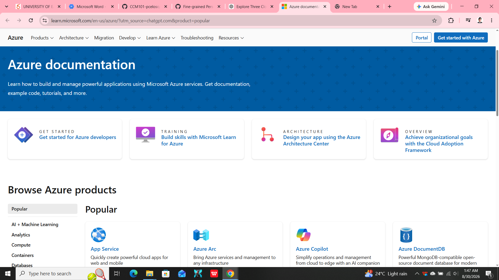

# Microsoft Azure Research

## Brief Overview

Microsoft Azure is Microsoft's cloud computing platform. It provides cloud services for computing, storage, networking, databases, artificial intelligence, security, and application development.

## Global Infrastructure

Azure provides a worldwide cloud infrastructure consisting of regions and availability options. Organizations can deploy applications and services in locations that meet their performance, availability, and compliance requirements.

## Cloud Management Console

The Azure Portal is a web-based management interface that allows users to create, configure, monitor, and manage Azure resources.

## Four Core Services

### 1. Azure Virtual Machines

Azure Virtual Machines provide virtualized computing resources for running operating systems and applications.

### 2. Azure Blob Storage

Azure Blob Storage provides object storage for unstructured data such as documents, images, videos, and backups.

### 3. Azure Virtual Network

Azure Virtual Network allows Azure resources to communicate securely within virtual networks.

### 4. Microsoft Entra ID

Microsoft Entra ID provides identity and access management for users, applications, and resources.

## Three Advantages

1. Azure has strong integration with Microsoft technologies.
2. Azure provides many enterprise cloud services.
3. Azure supports hybrid cloud environments.

## Typical Enterprise Use Cases

Azure can be used for enterprise applications, Windows Server workloads, Microsoft 365-related environments, databases, virtual machines, AI applications, and hybrid cloud deployments.

## Screenshot Evidence

