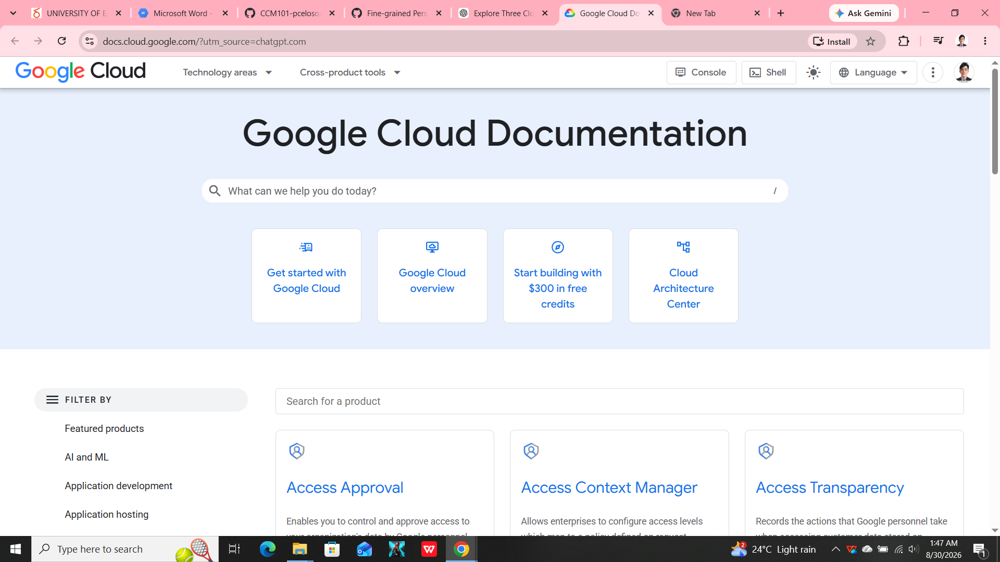

# Google Cloud Platform Research

## Brief Overview

Google Cloud Platform (GCP) is Google's cloud computing platform. It provides services for computing, storage, databases, networking, artificial intelligence, machine learning, analytics, and application development.

## Global Infrastructure

Google Cloud operates a global infrastructure that allows organizations to deploy applications and services across different geographic locations. Its infrastructure includes regions and zones designed to support availability and performance.

## Cloud Management Console

The Google Cloud Console is a web-based interface for creating, configuring, monitoring, and managing Google Cloud resources and services.

## Four Core Services

### 1. Compute Engine

Compute Engine provides virtual machines that can run applications and workloads.

### 2. Cloud Storage

Cloud Storage provides object storage for files, backups, media, and other data.

### 3. Google Kubernetes Engine

Google Kubernetes Engine (GKE) provides a managed environment for deploying and managing containerized applications using Kubernetes.

### 4. Cloud IAM

Cloud Identity and Access Management allows organizations to manage permissions and access to Google Cloud resources.

## Three Advantages

1. Google Cloud has strong capabilities in artificial intelligence and machine learning.
2. Google Cloud provides managed Kubernetes through GKE.
3. Google Cloud provides a global infrastructure for deploying applications.

## Typical Enterprise Use Cases

GCP can be used for artificial intelligence, machine learning, data analytics, Kubernetes applications, web applications, cloud storage, and large-scale data processing.

## Screenshot Evidence

